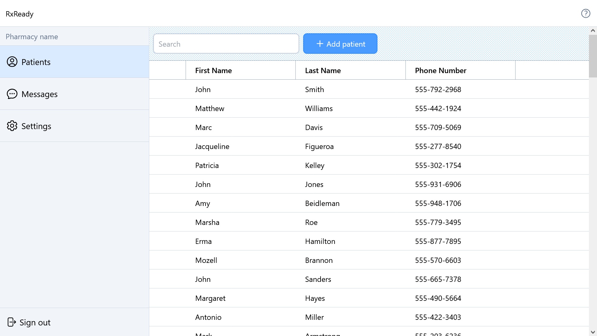

## Getting Started

Install npm dependencies

```
npm i
```

Run dev script

```
npm run dev
```

Run the following command to automatically rebuild the CSS

```
npx tailwindcss -i ./src/index.css -o ./dist/output.css --watch
```
